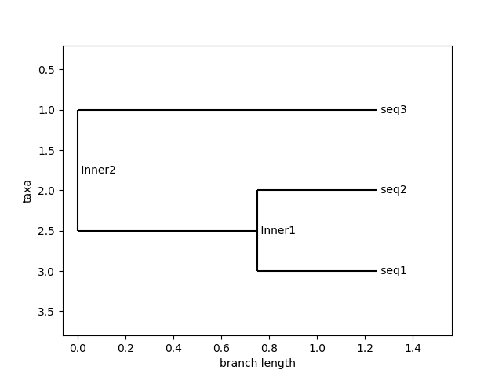

# PhyloGenix: Phylogenetic Tree Generator

This is a python based program that generates phylogenetic trees from sequence data in FASTA format. It leverages sequence alignment and evolutionary distance calculations to construct trees using UPGMA and Neighbor-Joining methods.
<br><br>

## Features
- Parses sequence data from FASTA files
- Computes pairwise evolutionary distances using sequence alignment
- Supports tree construction via UPGMA and Neighbor-Joining algorithms
- Provides ASCII and graphical visualizations of the phylogenetic tree
- Outputs the tree in Newick format for further analysis

## What is a FASTA File?
A FASTA file is a text-based format for representing nucleotide or protein sequences. Each sequence starts with a header line 
**(beginning with >)**, followed by one or more lines of sequence data.
```plaintext
>sequence_1
ATCGATCGATCG
>sequence_2
GCTAGCTAGCTA
```
FASTA files are commonly used in bioinformatics for sequence alignment and phylogenetic analysis.

## How to Run the Program
### 1. Clone or Download the Repository
```plaintext
git clone https://github.com/nuhaaajamu/phylogenix.git
cd phylogenix
```
### 2. Install Dependencies
Ensure you have Python installed, then install required libraries:
```plaintext
pip install biopython matplotlib
```
### 3. Run Program
Run the script and provide user input when prompted:
```plaintext
python phylo_tree_builder.py
```
### 4. User Input
- Enter the path to your FASTA file
- Choose a tree construction method: UPGMA or NJ (Neighbor-Joining)

### Example Usage:
```plaintext
Enter the path to your FASTA file: file_name.fasta
Enter the tree construction method (UPGMA/NJ): UPGMA
```

## Visualization Using FASTA File Example

This is an example tree that is generated using the "example_file.fasta" file in the repository and UPGMA algorithm



## Dependencies
- Python 3.7+
- Biopython 
- Matplotlib

## Future Improvements
- Support for additional phylogenetic algorithms
- Integration with multiple sequence alignment tools
- Enhanced interactive visualization options

## Contributions
Contributions are more than welcome! If this project is something that has sparked your interest, feel free to submit issues, feature requests, or pull requests.

## License
This is an open-source project and is licensed under the MIT License.


