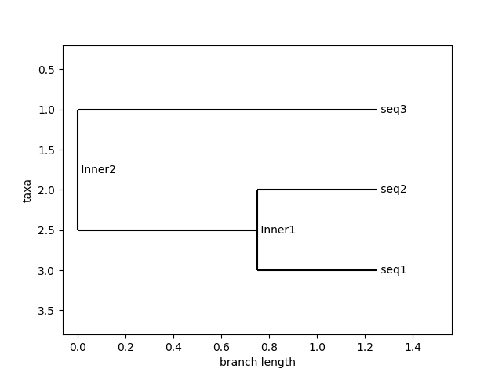
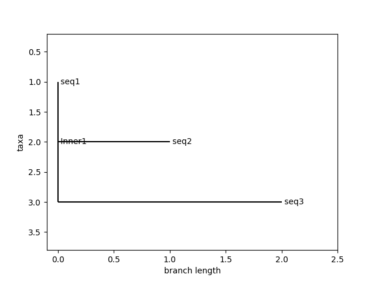

# PhyloGenix: Phylogenetic Tree Generator

This is a Python based program that generates phylogenetic trees from sequence data in FASTA format. It leverages sequence alignment and evolutionary distance calculations to construct trees using UPGMA and Neighbor-Joining algorithm methods.
<br><br>

## Features
- Parses sequence data from FASTA files
- Computes pairwise evolutionary distances using sequence alignment
- Supports tree construction via UPGMA and Neighbor-Joining algorithms
- Provides ASCII and graphical visualizations of the phylogenetic tree
- Outputs the tree in Newick format for further analysis

## What is a FASTA File?
A FASTA file is a text-based format for representing nucleotide or protein sequences. Each sequence starts with a header line 
**(beginning with >)**, followed by one or more lines of sequence data.

**Example Format:**
```plaintext
>sequence_1
ATCGATCGATCG
>sequence_2
GCTAGCTAGCTA
```
FASTA files are commonly used in bioinformatics for sequence alignment and phylogenetic analysis.

## UPGMA vs. Neighbor-Joining Algorithms

When constructing phylogenetic trees, different algorithms influence the structure and interpretation of evolutionary relationships. This project implements both **UPGMA (Unweighted Pair Group Method with Arithmetic Mean)** and **Neighbor-Joining (NJ)** to generate phylogenetic trees, each with distinct computational approaches and visual outcomes.  

### Key Differences:
| Feature            | UPGMA                              | Neighbor-Joining (NJ) |
|--------------------|----------------------------------|----------------------|
| **Methodology**   | Assumes a **molecular clock**, meaning all lineages evolve at a constant rate. | Does **not** assume a molecular clock, allowing for varying rates of evolution. |
| **Tree Type**     | Produces an **ultrametric tree**, where all leaf nodes are equidistant from the root. | Produces an **additive tree**, where branch lengths reflect evolutionary distance. |
| **Accuracy**      | Works best for **data with equal mutation rates** across lineages. | More flexible and accurate for **real-world biological data** with different mutation rates. |
| **Visualization** | The tree appears more **balanced and uniform** due to the equal evolutionary rates assumption. | The tree may appear **asymmetric**, reflecting varying rates of evolution across species. |
<br><br>

### How This Affects Visualization:
- **UPGMA Trees**: Tend to look more **symmetrical**, as all taxa are assumed to have evolved at the same rate.
- **NJ Trees**: Can appear **asymmetrical**, as taxa with different mutation rates will have branches of varying lengths.

By incorporating both algorithms, this project provides a broader perspective on phylogenetic tree construction, allowing for comparisons in evolutionary modeling.

## How to Run the Program
### 1. Clone the Repository
```plaintext
git clone https://github.com/nuhaaajamu/phylogenix.git
cd phylogenix
```
### 2. Install Dependencies
Ensure you have Python (version 3.7+) installed, then install these required libraries:
```plaintext
pip install biopython matplotlib
```
### 3. Run Program
Run the script and provide user input when prompted:
```plaintext
python phylo_tree_builder.py
```
### 4. User Input
- Enter the path to your FASTA file
- Choose a tree construction method: UPGMA or NJ (Neighbor-Joining)

### Example Usage:
```plaintext
Enter the path to your FASTA file: file_name.fasta
Enter the tree construction method (UPGMA/NJ): UPGMA
```

## Visualization Using FASTA File Example

Example trees generated using the **example_file.fasta** file in the repository 
<br><br>

<p align="center"><strong>UPGMA Algorithm Tree Construction</strong></p>

<p align="center">
  
</p>

<br><br>

<p align="center"><strong>Neighbor-Joining Algorithm Tree Construction</strong></p>

<p align="center">
  
</p>

## Dependencies
- Python 3.7+
- Biopython 
- Matplotlib

## Future Improvements
- Support for additional phylogenetic algorithms
- Integration with multiple sequence alignment tools
- Enhanced interactive visualization options

## Contributions
Contributions are more than welcome! If this project is something that has sparked your interest, feel free to submit issues, feature requests, or pull requests.

## License
This is an open-source project and is licensed under the MIT License.


